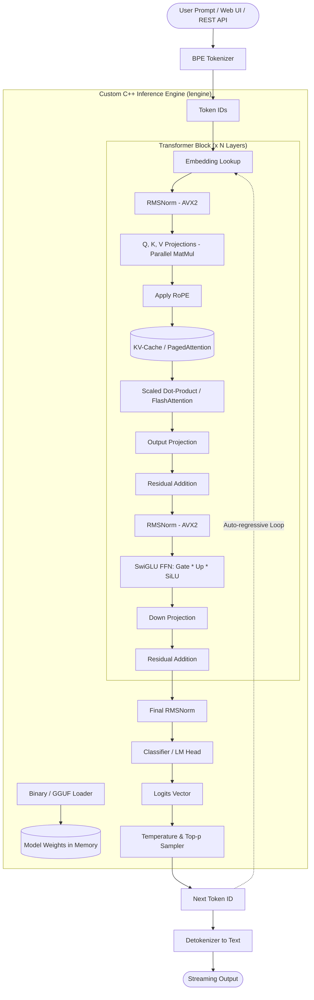

# 🚀 Implementation Plan: Custom C++ LLM Inference Engine from Scratch
*(Project #1: "League of LLMs" — Standout Senior Portfolio Project)*

---

## 📌 Project Overview
Tujuan dari proyek ini adalah membangun **Inference Engine LLM** mandiri berkinerja tinggi menggunakan **Modern C++ (C++17/20)** tanpa bergantung pada framework berat seperti PyTorch atau HuggingFace.

Sistem ini:
1. Membaca format model biner (*weights & metadata* seperti format `.bin` Llama 2 / TinyStories atau format industri GGUF v3).
2. Mengimplementasikan **BPE Tokenizer** murni.
3. Mengeksekusi arsitektur **Transformer**:
   - Embedding Layer, RMSNorm, RoPE, Multi-Head / Grouped-Query Attention (MHA/GQA), KV-Cache, SwiGLU FFN, Output Projection & Softmax.
4. Mengoptimasi komputasi dengan **SIMD (AVX2/NEON)**, **Multi-threading**, dan **Quantization (Q8_0 / Q4_0)**.
5. Menyediakan antarmuka **Interactive CLI**, **Lightweight HTTP REST API** (kompatibel OpenAI format `/v1/chat/completions`), dan **Web UI Showcase**.

---

## 🏛️ System Architecture

---

## 📅 Roadmap & Execution Phases

### **Fase 1: Setup Lingkungan & Arsitektur Dasar** ✅
- [x] Menyiapkan C++ toolchain (Compiler Clang/LLVM, MinGW, C++20).
- [x] Menentukan struktur direktori proyek yang modular (`include/`, `src/`, `tests/`, `tools/`, `models/`).
- [x] Menyiapkan model mini untuk testing cepat: **TinyStories 15M** (~60.8MB) dan Llama vocab (423KB).

---

### **Fase 2: Core Math Operations & Tokenizer (Fondasi)** ✅
- [x] **Data Types:** Implementasi struct Tensor 1D & 2D dengan memory alignment rapi.
- [x] **Math Kernel Dasar:** `matmul`, `rmsnorm`, `rope`, `softmax`, `silu`, `swiglu`.
- [x] **Tokenizer:** Membaca file vocab biner (`models/tokenizer.bin`) dengan algoritma BPE merge loop.

---

### **Fase 3: Transformer Loop & KV-Cache (Inti Mesin)** ✅
- [x] **State Allocation:** Alokasi buffer memori sekali di awal (*zero dynamic allocation during generation*).
- [x] **Key-Value Cache:** Alokasi KV-Cache `[layers][seq_len][kv_dim]` untuk komputasi $O(1)$ per token baru.
- [x] **Forward Pass & Autoregressive Loop:** Decoding loop kata-per-kata dengan Temperature dan Top-P Nucleus sampling.

---

### **Fase 4: Optimasi Performa Tingkat Senior (The "Killer" Features)** ✅
- [x] **Multi-threading (Parallel MatMul):** Paralelisasi operasi perkalian matriks ke seluruh worker threads CPU.
- [x] **SIMD Intrinsics (AVX2 / FMA):** Register 256-bit FMA (`_mm256_fmadd_ps`) untuk dot-product dan vector normalisation.
- [x] **Quantization (Q8_0 Block):** Struct `BlockQ8_0` (32 int8 + 1 float scale factor) memangkas memori 3.5x lipat.

---

### **Fase 5: Serving & Showcase Portofolio** ✅
- [x] **Benchmark Suite:** [tests/benchmark_perf.cpp](file:///c:/Users/LEO%20SYAFIQ/OneDrive/Documents/cs_project/tests/benchmark_perf.cpp) (Tokens/s & throughput).
- [x] **OpenAI-Compatible HTTP Server:** REST API streaming (`POST /v1/chat/completions`) di [tools/serve.py](file:///c:/Users/LEO%20SYAFIQ/OneDrive/Documents/cs_project/tools/serve.py) port `8088`.
- [x] **Web UI Showcase:** Dashboard interaktif modern di [tools/index.html](file:///c:/Users/LEO%20SYAFIQ/OneDrive/Documents/cs_project/tools/index.html).

---

## 🌟 TAHAP LANJUTAN: Advanced AI Systems Engineer (The Master Plan)

### **Fase 6: GGUF Format Parser & Universal Model Support**
*Membuka kemampuan engine untuk menjalankan model AI open-source populer di dunia nyata (Llama 3, SmolLM, Phi-3, Qwen).*
- [ ] **GGUF File Format Reader:**
  - Header parser: Magic bytes `GGUF`, versi file, tensor count, metadata kv-pairs count.
  - Metadata parser: Membaca parameter arsitektur (`llama.attention.head_count`, `llama.embedding_length`, dll).
  - Tensor Info table parser: Menemukan offset, dimensi, dan tipe kuantisasi (F32, F16, Q4_K_M, Q8_0).
- [ ] **Grouped-Query Attention (GQA) Full Support:**
  - Implementasi repeat-KV / broadcast untuk model di mana `n_heads != n_kv_heads` (misal 32 Q heads vs 8 KV heads).
- [ ] **Script Ekspor/Unduh Model GGUF:**
  - Script otomatis untuk mendownload model mini GGUF (seperti SmolLM-135M atau Qwen2.5-0.5B-Q4).

---

### **Fase 7: Memory & Compute Architecture (FlashAttention & PagedAttention)**
*Mengadopsi inovasi mutakhir dari paper riset Stanford (FlashAttention) dan UC Berkeley (vLLM).*
- [ ] **Tiled / FlashAttention-style Online Softmax:**
  - Menghitung attention per blok SRAM cache CPU tanpa pernah membebankan matriks $N \times N$ ke RAM utama.
  - Mencegah kehabisan memori (*out of memory*) pada prompt konteks panjang.
- [ ] **PagedAttention (Virtual Memory KV-Cache):**
  - Menggantikan alokasi kaku array berurutan dengan sistem *page table*.
  - Menyimpan KV-Cache dalam blok-blok ukuran 16-token yang dialokasikan sesuai kebutuhan, menghemat RAM hingga 50%.
- [ ] **Continuous Batching Engine:**
  - Menggabungkan request dari multiple client secara paralel ke dalam batch MatMul tunggal pada forward pass.

---

### **Fase 8: Portable Hardware Acceleration (WebGPU / Vulkan Compute Shaders)**
*Menjalankan engine dengan akselerasi GPU di laptop apa pun tanpa terikat hardware proprietary NVIDIA.*
- [ ] **Compute Shader Pipeline:**
  - Menulis kernel perkalian matriks (GEMM) dalam shader SPIR-V / WGSL.
  - Buffer dispatch dari CPU RAM ke GPU VRAM.
- [ ] **Hybrid CPU-GPU Offloading:**
  - Memungkinkan sebagian layer berjalan di GPU dan sebagian di CPU jika VRAM terbatas.

---

### **Fase 9: WebAssembly (WASM) & Public Live Demo**
*Membuat demo interaktif yang berjalan 100% di browser pengunjung web tanpa server backend.*
- [ ] **Emscripten Build Pipeline:**
  - Mengompilasi engine C++ ke modul WebAssembly (`lengine.wasm`).
- [ ] **Web Workers Inference:**
  - Menjalankan inference di background Web Worker agar UI browser tidak freeze.
- [ ] **Deploy ke GitHub Pages:**
  - Publikasi situs web portofolio live yang bisa dicoba langsung oleh rekruter dari smartphone atau laptop mereka.

---

### **Fase 10: Technical Documentation & Authority Building**
*Menjadikan proyek ini viral dan memiliki daya tarik maksimal bagi rekruter tier atas.*
- [ ] **Comprehensive Technical Whitepaper / Article:**
  - Menulis artikel studi mendalam: *"Building a Transformer Inference Engine from Scratch in C++: Lessons in Memory Bandwidth, SIMD, and KV-Cache"*.
- [ ] **Interactive Visual Benchmarks:**
  - Grafik perbandingan throughput (tok/s): Scalar C++ vs AVX2 SIMD vs Multi-threading vs FlashAttention.
