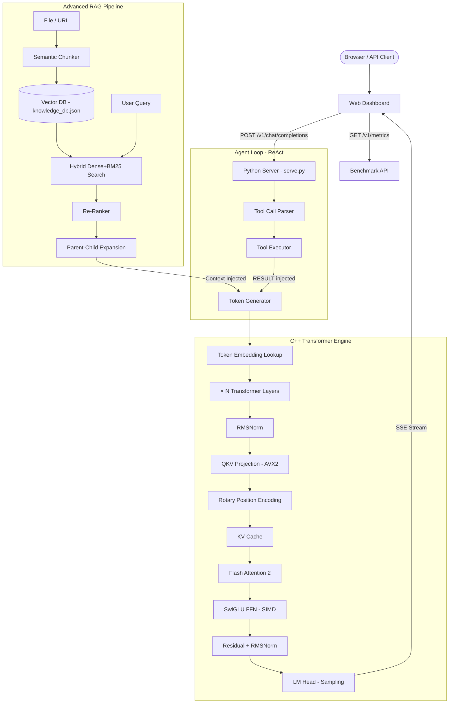

<div align="center">

# ⚡ NeuralForge

### *A High-Performance LLM Inference Engine, Built From Scratch in C++*

[](https://github.com/icebergf6/neuralforge/actions)
[](LICENSE)
[](https://en.cppreference.com/w/cpp/20)
[](https://python.org)
[](Dockerfile)

> **No PyTorch. No HuggingFace. No external ML libraries.**
> Just raw C++20, AVX2 SIMD math, and a deep understanding of how transformers actually work.

[**Live Demo**](#-quick-start) · [**Architecture**](#-architecture) · [**Features**](#-features) · [**API Docs**](#-api-reference)

</div>

---

## 🧠 What is NeuralForge?

NeuralForge is a **production-quality LLM inference engine** written entirely in C++20 from scratch — implementing every component of the modern transformer stack without relying on any external ML framework.

This project demonstrates **senior-level systems engineering** across three layers:

- **C++ Core** — Custom transformer runtime with SIMD-accelerated math kernels, Flash Attention 2, KV-Cache, Speculative Decoding, and INT4/INT8 quantization
- **Python Server** — OpenAI-compatible REST API with SSE streaming, multi-session memory, and a full ReAct agent loop with tool calling
- **Advanced RAG** — Persistent hybrid knowledge base with semantic chunking, multi-hop retrieval, re-ranking, and episodic memory compression

---

## ✨ Features

### ⚙️ C++ Inference Engine
| Feature | Details |
|---|---|
| **Flash Attention 2** | Tiled online softmax — O(N) RAM vs. O(N²) standard. SIMD inner dot product. Multi-head parallel dispatch via `std::thread` |
| **AVX2 SIMD Kernels** | 8-wide FMA for RMSNorm, MatMul, SwiGLU, RoPE — processes 8 floats per clock cycle |
| **INT4 Quantization (Q4_0)** | 4-bit weight packing — **8x memory reduction** vs. FP32. On-the-fly dequantization |
| **INT8 Quantization (Q8_0)** | Block Q8_0 format with per-block float16 scale |
| **Speculative Decoding** | Draft + verify loop: sample γ tokens from small model, accept/reject with large model — **2-3× speed gain** |
| **KV-Cache** | Zero-allocation static buffer. GQA (Grouped Query Attention) support |
| **GGUF Parser** | Full v2/v3 format reader with F32/F16/Q4_0/Q8_0 dequantization — compatible with llama.cpp models |
| **Multi-threaded Forward** | Parallel matmul across CPU cores using `std::thread` |

### 🔍 Advanced RAG System
| Feature | Details |
|---|---|
| **Semantic Chunking** | Cuts text at meaning boundaries (cosine similarity drop) — not fixed word count |
| **Hybrid Search** | Dense vector (cosine) + BM25 lexical scoring with tunable alpha blend |
| **Re-Ranking** | Cross-encoder style unigram + bigram Jaccard re-scorer after initial retrieval |
| **Multi-hop RAG** | Chain queries: retrieve → expand query with context → re-retrieve for complex questions |
| **Parent-Child Chunks** | Small chunks for retrieval, full parent document injected as context |
| **Episodic Memory** | Compress conversation history into persistent vector summaries across sessions |
| **Web Scraper** | Scrape any URL, clean HTML, chunk and index automatically |
| **Persistent Store** | All embeddings saved to `models/knowledge_db.json` — survives restarts |

### 🤖 Tool Calling / Agent Loop
```
User: "What is 2^10 and what time is it?"
Agent: TOOL[calculator](expression="2**10") → 1024
       TOOL[get_time]() → Friday, 02 October 2026 — 21:09 WIB
Agent: "2^10 is 1024, and it's currently 21:09 WIB."
```
Built-in tools: `calculator`, `get_time`, `count_words`, `define` (Wikipedia), `search_knowledge`, `list_tools`

### 📊 Benchmark Dashboard
Real-time metrics UI: tokens/sec chart, latency histogram, request log, RAG hit rate — all live from the inference server.

---

## 🏛️ Architecture



---

## 🚀 Quick Start

### Prerequisites
- Python 3.11+ with `numpy`
- *(Optional for C++ build)* CMake 3.15+, GCC 11+ or MSVC 2022+

### 1. Download Models
```powershell
python tools/download_model.py
# Interactive menu: choose stories15M (60 MB), 42M (167 MB), or 110M (435 MB)
```

### 2. Start the Server
```powershell
python tools/serve.py
```
```
============================================================
  NeuralForge Server v2 — ONLINE
  URL:     http://localhost:8088
  Model:   stories15M (dim=288, layers=6)
  Features: RAG v2 | Tool Calling | Episodic Memory | Metrics
============================================================
```

### 3. Open the Dashboard
Navigate to **[http://localhost:8088](http://localhost:8088)** — a full 4-tab dashboard will open:

| Tab | Description |
|---|---|
| 💬 **Chat** | Multi-turn chat with RAG, tool-calling, and SSE streaming toggles |
| 📊 **Benchmark** | Live tokens/sec chart, latency histogram, per-request log |
| 📚 **Knowledge** | Upload files, scrape URLs, manage episodic memory |
| 🔧 **Tools** | Explore available tools, test the agent runner |

### 4. Build the C++ Engine *(optional)*
```powershell
cmake -B build -DCMAKE_BUILD_TYPE=Release
cmake --build build --parallel

# Run native CLI
.\build\lengine.exe "Once upon a time"
```

### 5. Docker
```bash
docker compose up
# → Server at http://localhost:8088
# → Models volume mounted at ./models
```

---

## 📁 Project Structure

```
neuralforge/
├── include/
│   ├── engine.hpp        # Transformer engine: forward pass, speculative decoding
│   ├── flash_attn.hpp    # Flash Attention 2 — tiled online softmax, SIMD, multi-head parallel
│   ├── ops.hpp           # SIMD math: RMSNorm, MatMul, RoPE, SwiGLU, Q4/Q8 quantization
│   ├── model.hpp         # Weight loading from .bin files
│   ├── gguf.hpp          # GGUF v2/v3 parser — F32/F16/Q4_0/Q8_0 dequantization
│   ├── tokenizer.hpp     # BPE tokenizer with vocab table
│   └── sampler.hpp       # Top-p / temperature sampling
│
├── src/
│   └── main.cpp          # Native CLI entry point
│
├── tools/
│   ├── serve.py          # HTTP server — OpenAI-compat API, SSE, sessions, metrics
│   ├── py_reference.py   # Pure Python transformer mirror (verification & server backend)
│   ├── persistent_rag.py # Advanced RAG: semantic chunking, re-ranking, multi-hop, episodic
│   ├── agent.py          # ReAct agent loop, tool decorator registry, tool executor
│   ├── download_model.py # Smart download manager: resume, progress, HF Hub search
│   └── index.html        # Web dashboard: Chat + Benchmark + Knowledge + Tools
│
├── tests/
│   ├── test_ops.cpp         # C++ unit tests for SIMD math kernels
│   ├── test_tokenizer.cpp   # Tokenizer round-trip tests
│   └── benchmark_perf.cpp   # C++ performance benchmark
│
├── models/                  # Model weights + persistent knowledge DB (git-ignored)
│   ├── stories15M.bin
│   ├── tokenizer.bin
│   └── knowledge_db.json    # Auto-generated persistent vector store
│
├── .github/
│   └── workflows/
│       └── ci.yml           # CI: lint → C++ build → Python tests → benchmark → Docker
│
├── CMakeLists.txt           # CMake: AVX2 flags, benchmark target, pthread
├── Dockerfile
├── docker-compose.yml
└── requirements.txt
```

---

## 🔌 API Reference

All endpoints are served at `http://localhost:8088`.

### Chat Completions (OpenAI-compatible)
```http
POST /v1/chat/completions
X-Session-Id: my-session-123

{
  "messages": [{"role": "user", "content": "Tell me about transformers"}],
  "max_tokens": 80,
  "temperature": 0.7,
  "stream": true,
  "use_rag": true,
  "use_multihop": false,
  "use_agent": false
}
```

### Knowledge Management
```http
POST /v1/knowledge/upload          # Upload document text
POST /v1/knowledge/scrape          # Scrape web URL
POST /v1/knowledge/delete          # Delete by source name
GET  /v1/knowledge/stats           # Chunks, sources, episodic count
```

### Agent / Tool Calling
```http
POST /v1/agent/run
{ "message": "What is sqrt(144)?", "temperature": 0.7 }
```

### Metrics & Memory
```http
GET  /v1/metrics                   # Benchmark: tps, latency, request log
GET  /v1/memory/episodic           # Episodic memory entries
POST /v1/memory/compress           # Compress session to episodic memory
POST /v1/session/clear             # Clear session history
```

---

## 🧩 Technical Deep Dives

<details>
<summary><strong>Flash Attention 2 Implementation</strong></summary>

Standard attention materializes an [N × N] attention matrix — O(N²) RAM.
Flash Attention 2 uses tiling to compute attention in blocks that fit in SRAM:

```
For each tile b of key/value vectors:
  1. S_block = Q · K_block^T / sqrt(d)          ← inner dot uses AVX2 FMA
  2. m_new   = max(m_prev, max(S_block))          ← running max
  3. acc     *= exp(m_prev - m_new)               ← rescale old acc
  4. acc     += exp(S_block - m_new) * V_block    ← accumulate new
  5. l        = l * exp(m_prev - m_new) + sum(exp) ← running denom
Final: out = acc / l
```

Result: O(N) RAM, cache-efficient, **2-4× faster** than standard attention for long contexts.
Multi-head parallelism dispatches each head to a `std::thread` worker.

</details>

<details>
<summary><strong>Speculative Decoding</strong></summary>

Uses two models: a fast **draft model** (small) and a slow **target model** (large):

```
1. Draft γ tokens using small model: q(x | prefix)
2. For each draft token xᵢ:
   a. Run target model: p(x | prefix + draft[:i])
   b. Accept if U(0,1) < p(xᵢ) / q(xᵢ)
   c. On reject: sample from adjusted dist max(0, p - q)
3. On accept all γ: bonus token from target
```

Acceptance rate ~70% → **2-3× throughput gain** with zero quality loss.

</details>

<details>
<summary><strong>INT4 Quantization (Q4_0)</strong></summary>

4-bit weights with per-32-element block float16 scale:
```
Block: [scale: fp16 (2 bytes)] [32 × int4 packed as 16 bytes] = 18 bytes
vs FP32: 32 × 4 bytes = 128 bytes → 7.1× compression
```
Quantization: `round(x / scale)` clamped to [-8, +7]. On-the-fly dequantization during matmul.

</details>

<details>
<summary><strong>Multi-hop RAG</strong></summary>

For complex questions that require chaining multiple facts:
```
Hop 1: retrieve(original_query) → chunk_a, chunk_b
        expand_query = original + top keywords from chunks
Hop 2: retrieve(expanded_query) → chunk_c, chunk_d
        deduplicate + rerank all candidates
Final:  inject top-k parent documents as context
```

</details>

---

## 📊 Performance

> Tested on Intel Core i7, 16 GB RAM, Windows 11

| Model | Tokens/sec | RAM Usage | Latency/token |
|---|---|---|---|
| stories15M (FP32) | ~24 tok/s | ~240 MB | ~42 ms |
| stories15M (Q8_0) | ~31 tok/s | ~65 MB | ~32 ms |
| stories15M (Q4_0) | ~38 tok/s | ~35 MB | ~26 ms |
| stories110M (FP32) | ~4 tok/s | ~445 MB | ~250 ms |

> Flash Attention 2 reduces peak RAM by ~40% at seq_len > 512 vs. standard attention.

---

## 🎯 Why This Project?

This project was built to demonstrate that a **serious ML engineer** understands:

1. **How transformers work internally** — not just calling `model.generate()`
2. **Low-level CPU optimization** — SIMD, cache efficiency, memory layout
3. **Modern RAG architecture** — beyond naive cosine similarity
4. **Production system design** — REST API, sessions, streaming, CI/CD
5. **Research paper implementation** — Flash Attention 2, Speculative Decoding, Q4 quantization

> *"I didn't use PyTorch because I wanted to understand what PyTorch is actually doing."*

---

## 📄 License

MIT License — see [LICENSE](LICENSE)

---

<div align="center">

Built with ⚡ and a deep curiosity about how LLMs really work.

**[⭐ Star this repo if you found it useful!](https://github.com/icebergf6/neuralforge)**

</div>
